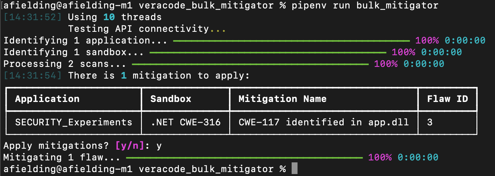

# Veracode SAST Bulk Mitigator

**Note this tool is not an official Veracode product. It comes with no support or warranty.**

## Introduction

This tool performs bulk mitigation actions on open Veracode SAST flaws reported in multiple application profiles. The definitions of what to mitigate (e.g. file name, line number) and the mitigation comments and actions to apply are defined via a JSON file. Application profile names to target are specified via a text file or alternatively a flag can be set to process all application profiles.

There are two primary uses cases this tool solves:
1. Bulk mitigating flaws - useful for development teams/security champions
2. Bulk accepting mitigated flaws - useful for security teams

### 1. Bulk Mitigating Flaws

Development teams or security mentors could use this tool to propose mitigations (e.g. Mitigate By Design, False Positive) for idential flaws that are reported in a number of application profiles.

### 2. Bulk Accepting Mitigated Flaws

The tool can be used by security teams for bulk-approving or rejecting mitigations that have been reviewed, where those flaws arise form 2nd party components that are reported in more than one application profile.

## Key Features ✅

* Uses the standard [Veracode API credentials file](https://docs.veracode.com/r/c_configure_api_cred_file)
* Shows a summary before any action is carried out
* Can propose and/or approve/reject mitigations in bulk
* Multithreaded for speed

## What To Mitigate

For targeted mitigation, the tool will check for all 5 matching signatures when considering every open flaw for each application specified:

1. CWE
2. Module name
3. File name
4. Attack vector
5. Line Number

The applications can be specified using a text file `data/application_names.txt`. It is recommended when testing a new mitigation signature to only use a single application profile name in this text file. Once the tool has been verified to work as expected the file can be updated to include more profile names, or alternatively specify `--all-application-profiles=true` to apply mitigations across all the application profiles.

The tool will not take any mitigation action until the user explicitly enters "y" to apply the mitigations once a summary of what will be mitigated has been presented.

## Demo

You can see a demo of the tool below:



## Multiple Mitigation Actions

The tool can be used to apply a single action or multiple mitigation actions per flaw, for example a "Mitigate By Design" or a "False Positive" followed by an "Approve" action. The tool will make sure they are applied in a logical order. It is not allowed to specify both "Mitigate By Design" and "False Positive" because that does not make sense as only one of those statements can be true.

It is also possible to propose an "Accept the Risk" action prior to "Approve" if that is how your organisation operates.

## Authenticating With The Veracode APIs

This tool makes use of the Veracode APIs ([listed below](#outbound-api-calls)). You will need Veracode API credentials
and the [Reviewer or Security Lead role](https://docs.veracode.com/r/c_API_roles_details#results-api) for this tool to
work. We recommend you configure
a [Veracode API credentials file](https://docs.veracode.com/r/c_configure_api_cred_file).

## Installation 📦

Follow these steps to install the tool:

1. Ensure you have [Python 3](https://www.python.org/downloads/) installed.
2. Install [Pipenv](https://pipenv.pypa.io/) typically via your package manager or by running `pip install --user --upgrade pipenv`
3. Clone this repository `git clone https://github.com/antfie/veracode_bulk_mitigator/tree/main`
4. Ensure you have a [Veracode API credentials file](https://docs.veracode.com/r/c_api_credentials3) configured.

## Running

1. Ensure you have configured and reviewed appropriate mitigation signatures in `data/approved_bulk_mitigations.json` (see below for the documentation of this file).
2. Make sure you have added a list of applications to `data/application_names.txt`, or alternatively to run against all application profiles, set this flag when running the tool `--all-application-profiles=true`.  
3. Run the below command to run the tool. Note that the tool will not make any changes unless you enter "y" at the prompt following the summary of mitigations to add.

    ```bash
    pipenv run bulk_mitigator
    ```

## Command Arguments

| Argument                      | Default Value                       | Notes                                                                                      |
|-------------------------------|-------------------------------------|--------------------------------------------------------------------------------------------|
| --mitigations-file            | data/approved_bulk_mitigations.json | The file path to mitigations.json                                                          |
| --all-application-profiles    | false                               | Set to `true` to process all application profiles                                          |
| --application-names-file      | data/application_names.txt          | The file path to a text file listing application names, per line                           |
| --number-of-threads           | 10                                  | The number of threads to use for making simultanious API calls                             |
| --application-cache-file-path |                                     | A path to a CSV file to be used for caching application and sandbox name to GUID mappings  |
| --auto-apply-mitigations      | false                               | Set this to true to skip the prompt and apply the mitigations. Use caution with this flag. |

## mitigations.json File Format

mitigations.json is a JSON file which can contain a number of bulk mitigation definitions.

| Property           | Notes                                                                                               |
|--------------------|-----------------------------------------------------------------------------------------------------|
| friendly_name      | A friendly name only used by this tool when producing the report                                    |
| process_policy     | Set to `true` to process policy-level scans                                                         |
| process_sandboxes  | Set to `true` to process sandbox scans                                                              |
| sandboxes          | This is an array of sandbox names to process. If the array is empty all sandboxes will be processed |
| cwe                | The CWE id to match                                                                                 |
| module             | The module name* to match                                                                           |
| file_path          | The file path* to match                                                                             |
| attack_vector      | The attack vector* to match                                                                         |
| line_number        | The line number to match                                                                            |
| mitigate_by_design | If this is present propose a Mitigate By Design mitigation                                          |
| false_positive     | If this is present propose a False Positive mitigation                                              |
| accept_risk        | If this is present propose an Accept The Risk mitigation                                            |
| approve            | If this is present the mitigation will be approved                                                  |
| reject             | If this is present the mitigation will be rejected                                                  |

&ast; You can find this information from the Flaw Details section of the Triage Flaws page. 

### Example

In the example below you can see how to use the [TSRV](https://docs.veracode.com/r/c_review_TSRV) format.

```json
[
  {
    "friendly_name": "CWE-117 identified in app.dll",
    "process_policy": true,
    "process_sandboxes": true,
    "sandboxes": [
      "Release"
    ],
    "cwe": 117,
    "module": "app.dll",
    "file_path": "app/controllers/portalcontroller.cs",
    "attack_vector": "microsoft_extensions_logging_abstractions_dll.Microsoft.Extensions.Logging.LoggerExtensions.LogInformation",
    "line_number": 75,
    "mitigate_by_design": "Technique : M1 :  Establish and maintain control over all of your inputs\nSpecifics : TODO\nRemaining Risk : TODO\nVerification : TODO",
    "false_positive": "TODO",
    "accept_risk": "Specifics : TODO\nRemaining Risk : TODO\nVerification : TODO",
    "approve": "TODO",
    "reject": "TODO"
  }
]
```

## Troubleshooting

If you experience issues running pipenv see this [guide](https://pipenv.pypa.io/en/latest/installation.html). On Windows you may need to update your path environment variable. Alternatively try running pipenv via python like so:

```bash
python3 -m pipenv run bulk_mitigator
```

Finally, as a last resort consider using pip to install the dependencies:

```bash
python3 -m pip install --user -r requirements.txt
python3 bulk_mitigator.py
```

## Development

When repeatedly running the tool it helps to cache some of the requests to speed things up. Use this flag to do that:

```bash
pipenv run bulk_mitigator --application-cache-file-path=data/application_cache.csv
```

Note that if an application or sandbox is renamed/added/deleted then the cache may have stale data, so it is recommended to clear the cache file regularly.

## Development

There is a script to lint the code, keep dependencies up to date and run some tests:

```bash
pipenv run test
```
